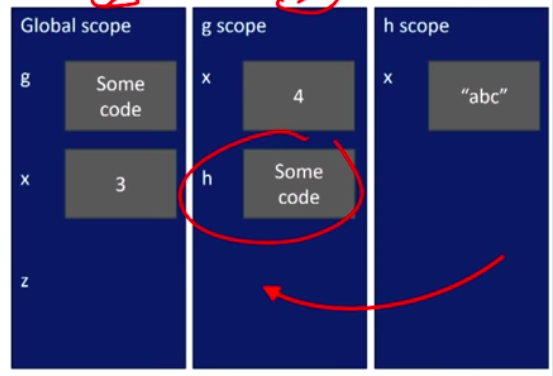
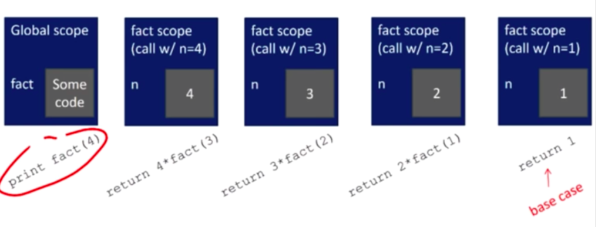

 

# 4. Functions

## Decomposition and Abstraction

### Apply 'Bunch of projectors' ideas to programming

- **Decomposition**
  - Break problem into different, self-contained(자립하는), pieces
- **Abstraction**
  - Suppress details of method to compute something from use of that computation


### Create structure with decomposition

- in example, separate devices
- in programming, divide code into **modules**
  - are "self-contained"
  - used to "break up" code
  - intended to be "reusable"
  - keep code "organized"
  - "keep code coherent(일관성 있는, 논리정연한)"
- this lecture, achieve decomposition with **functions**
- in a few weeks, achieve decomposition with **classes**


### Suppress details with abstraction

- in example, no need to know how to build a projector
- in programming, think of a piece of code as a **black box**
  - cannot see details
  - do not need to see details
  - do not want to see details
  - hide tedious coding details
- achieve abstraction with **function specifications** or **docstrings**


### Decomposition & Abstraction

- powerful together
- code can be used many times but only has to be debugged once!


### How to write and call/invoke a function

```python
# def : definition(keyword), is_even : name, i : parameters or arguments
def is_even(i):
    ## body starts ##
    # Specification, docstring
    """
    Input: i, a positive int
    Returns True if i is even, otherwise False
    """
    print("hi")
    return i % 2 == 0
	## body ends ##

# later in the code, you call the function using its name and values for parameters
is_even(3)
```

- docstring : special type of comment that is used to document what your function is doing. Explain what type argument(s) should have, and what your function is going to return.


## Calling Functions and Scope

### Variable scope

- **formal parameter** gets bound to the value of **actual parameter** when function is called
- new **scope/frame/environment** created when enter a function
- **scope** is mapping of names to objects


```python
def f(x):
    x = x + 1
    print('in f(x): x = ', x)
    return x
x = 3
z = f(x) # binding of returned value to variable z
```


### Functions as arguments

- arguments can take on any type, even functions

```python
def func_a():
    print('inside func_a')
def func_b(y):
    print('inside func_b')
    return y
def func_c(z):
    print('inside func_c')
    return z()
print(func_a()) # print 'inside func_a', 'None'
print(5 _ func_b(2)) # print 'inside func_b', '7'
print(func_c(func_a)) # print 'inside func_c', 'inside func_a', 'None'
```


### Scope example

- inside a function, **can access** a variable defined outside
- inside a function, **cannot modify** a variable defined outside

```python
def f(y):
    x = 1 # x is re-defined in scope of f
    x += 1
    print(x)
x = 5
f(x) # 2
print(x) # 5

def g(y):
    print(x)
    print(x + 1)
x = 5
g(x) # 5, 6 -> x inside g is picked up from scope that called function g
print(x) # 5

def h(y):
    x = x + 1
x = 5
h(x) # Unbounded LocalError: local vairable 'x' referenced before assignment
print(x)
```


### Scope details

```python
def g(x):
    def h():
        # print(x)
        x = 'abc'
    x = x + 1
    print('in g(x): x =', x)
    h()
    return x

x = 3
z = g(x)
```




cf. TA's answer

Pythons behaviour is completely consistent but confusing until you're used to it.

1. The rules below assume you didn't pass it to the function as a parameter (a different story for immutables & mutables).
2. If you declare a variable global or nonlocal (google it) then the external variable can be read & written from that point. You must not use it before you declare it global.
3. If you don't declare a global: 
   2a. if make an assignment to a variable name it is a local variable & nothing you do changes external variables of the same name. 
   2b. if you read it (with no prior assignment) Python will search all scopes for it (from local to nonlocal(s) to global) & use the first it finds (bind the first object it finds to the name for use as an undeclared global variable) 
   2c. if you read it (it's global but undeclared) and then write to it you get an error `globvar += 5` does this because it first reads globvar then writes to it (+= order of operation).
4. Be aware of mutables where 2b mutates to permit mutation but not replacement. So, if an object is mutable, you can write to the inside of an undeclared global object but not rewrite it.


## Keyword Arguments

### keyword arguments and default values

- Simple function definition, if last  argument is TRUE, then print lastName, firstName; else firstName, lastName

```python
def printName(firstName, lastName, reverse):
    if reverse:
        print(lastName + ', ' + firstName)
    else:
        print(firstName, lastName)
        
printName('Eric', 'Grimson', False)

printName('Eric', 'Grimson', reverse = False)
printName('Eric', lastName = 'Grimson', reverse = False)
printName(lastName = 'Grimson', firstName = 'Eric',  reverse = False)
```


## Specification

- a "contract" between the implementer of a function and the clients who will use it
  - "Assumptions": conditions that must be met by clients of the function; typically constraints on values of parameters
  - "Guarantees": conditions that must be met by function, providing it has been called in manner consistent with assumptions


### Exercise 6
string.capitalize() : change only the first letter to upper

string.replace() : find and change all


## Iteration vs Recursion

### What is recursion

- a way to design solutions to problems by **divide-and-conquer or** **decrease-and-conquer**
- a programming technique where a **function calls itself**
- in programming, goal is to NOT have infinite recursion
  - must have **1 or more base cases** that are easy to solve
  - must solve the same problem on **some other input** with the goal of simplifying the larger problem input


### Recursive function scope example

```python
def fact(n):
    if n == 1:
        return 1
    else:
        return n*fact(n-1)
    
print(fact(4))
```




### Some observations

- each recursive call to a function creates its **own scope/environment**
- **bindings of variables** in a scope is not changed by recursive call
  - using the same variable names but they are different objects in separate scopes
- flow of control passes back to **previous scope** once function call returns value


### Iteration vs. Recursion

```python
# Iteration
def factorial_iter(n):
    prod = 1
    for i in range(1, n+1):
        prod *= i
    return prod

# Recursion
def factorial(n):
    if n == 1:
        return 1
    else:
        return n*factorial(n-1)
```

- recursion may be simpler, more intuitive
- recursion may be efficient from programmer POV(Point Of View)
- recursion may not be efficient from computer POV


## Inductive Reasoning

### Mathematical induction

- To prove a statement indexed on integers is true for all values of n:
  - Prove it is true when n is smallest value (e.g. n = 0 or n = 1)
  - Then prove that if it is true for an arbitrary value of n, one can show that it must be true for n + 1


### Example of induction

- 0 + 1 + 2 + 3 + ... + n = (n(n+1))/2
- Proof
  - If n = 0, then LHS(Left Hand Side) is 0 and RHS is 0*1/2 = 0, so true
  - Assume true for some k, then need to show that
    - 0 + 1 + 2 + ... + k + (k + 1) = ((k + 1)(k + 2))/2
    - LHS is k(k + 1)/2 + (k + 1) by assumption that property holds for problem of size k
    - This becomes, by algebra, ((k + 1)/(k + 2))/2


## Towers of Hanoi

```python
def printMove(fr, to):
    print('move from ' + str(fr) + ' to ' + str(to))
    
def Towers(n, fr, to, spare):
    if n == 1:
        printMove(fr, to)
    else:
        Towers(n-1, fr, spare, to)
        Towers(1, fr, to, spare)
        Towers(n-1, spare, to, fr)
```


## Exercise: gcd recur

```python
def gcdRecur(a, b):
    '''
    a, b: positive integers
    
    returns: a positive integer, the greatest common divisor of a & b.
    '''
    # Your code here
    if b == 0:
        return a
    else:
        return gcdRecur(b, a % b)
```


## Fibonacci

```python
def fib(x):
    if x == 0 or x == 1:
        return 1
    else:
        return fib(x - 1) + fib(x - 2)
```


## Recursion on non-numerics

### Palindrome

```python
def isPalindrome(s):
    def toChars(s): # remove spaces between words
        s = s.lower()
        ans = ''
        for c in s:
            if c in 'abcdefghijklmnopqrstuvwxyz':
                ans = ans + c
        return ans
    
    def isPal(s):
        if len(s) <= 1:
            return True
        else:
            return s[0] == s[-1] and isPal(s[1:-1])
        
    return isPal(toChars(s))
```


### Divide and conquer

- an example of a "divide and conquer" algorithm
- solve a hard problem by breaking it into a set of sub-problems such that:
  - sub-problems are easier to solve than the original
  - solutions of the sub-problems can be combined to solve the original


## Files

### Example module

the file `circle.py` contains:

```python
pi = 3.14159
def area(radius):
    return pi*(radius**2)
def circumference(radius):
    return 2*pi*radius
```


then we can import and use this module:

```python
import circle
pi = 3
print(pi) # 3
print(circle.pi) # 3.14159
print(circle.area(3)) # 28.27431
print(circle.circumference(3)) # 18.849539999999998
```


we can use:

```python
from circle import *
print(pi)
print(area(3))
```


### Files

open and write:

```python
nameHandle = open('kids', 'w')
for i in range(2):
    name = input('Enter name: ')
    nameHandle.write(name + '\n')
nameHandle.close()
```


read:

```python
nameHandle = open('kids', 'r')
for line in nameHandle:
    print(line)
nameHandle.close()
```

