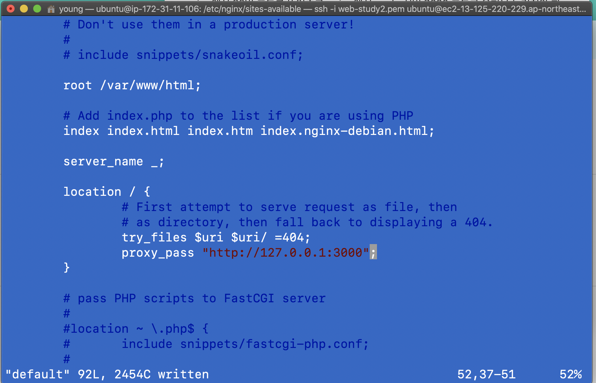

## Linting

코드의 문법, 스타일을 검사해주는 검사 프로세스

Linter가 linting을 수행함.


js는 ES lint를 쓴다.

ES lint 설치

: `npm install eslint --save-dev`

--save-dev는 dependencies에 안들어가고 devDependencies에 들어감.

검사 도구는 개발때나 필요하고 프로덕션 환경에는 필요가 없음.

프로덕션 환경은 - dev 의존성을 설치하지 않음


### 사용해보기

`node_modules/.bin/eslint --init`

옵션: default -> common js -> None of these -> No -> Node -> JSON


### 실행

`node_modules/.bin/eslint app.js`

에러가 뜨는데 실제로 에러를 발생시키지는 않는 것들도 같이 나온다.(warning 같은 것)


### 규칙 플러그인

사용하고 싶은 규칙들을 추가해서 쓸 수 있다.

https://www.npmjs.com/package/eslint-config-standard

`npm install --save-dev eslint-config-standard eslint-plugin-standard eslint-plugin-promise eslint-plugin-import eslint-plugin-node`


### .eslintrc.json

```json
{
    "env": {
        "browser": true,
        "commonjs": true,
        "es2020": true
    },
    "extends": "standard", // standard로 변경
    "parserOptions": {
        "ecmaVersion": 11
    },
    "rules": {
    }
}
```


`node_modules/.bin/eslint app.js --fix`

fix 옵션을 주면 알아서 수정까지 해준다.


### pre-commit hook : 협업 시 esLint 적용 방법

여러 사람의 작업 내용을 commit 시에 ES lint를 적용 가능

`npm install pre-commit --save-dev`


### package.json

```json
{
  "name": "server-test",
  "version": "0.0.0",
  "private": true,
  "scripts": {
    "start": "nodemon ./bin/www",
    "lint": "./node_modules/.bin/eslint ./routes/** app.js"
  },
  "pre-commit": ["lint"], // lint 사용하도록 설정
```


## logger

로그를 더 잘 만들어보자.

express는 기본적으로 morgan이라는 logger를 사용한다.


### app.js

```js
app.use(logger('dev'))
```

여기를 다음과 같이 바꿔준다:

```js
const logFormat = ':remote-addr [:date[clf]] ":method :url" :status :res[content-length] - :response-time ms ":user-agent" '
app.use(logger(logFormat))
```

이렇게 해놓으면 로그가 찍힌다.


## ec2

ec2 서버에서 로그를 남겨보도록 하자.

pm2가 설치되어있지 않다면:

`sudo npm install pm2 -g`


Pm2 서버를 시작하면서 로그를 남기는 옵션을 넣어줄 수 있다.

`pm2 start bin/www --name "hello" -o ../log/access.log -e ../log/error.log`

돌리는 서버의 이름을 설정해주고, log를 담을 파일의 경로를 지정해줄 수 있다.


### pm2-logrotate

`pm2 install pm2-logrotate`

로그를 특정 주기로, 또는 날짜를 남겨서 관리하는 것이 편하다.

`pm2 show pm2-logrotate`

여기서 Process configuration의 설정을 바꿔주면 된다.

파일 사이즈: `pm2 set pm2-logrotate:max_size 100M`

날짜 입력 포맷 : `pm2 set pm2-logrotate::dateFormat YYYY-MM-DD`

`pm2 set pm2-logrotate::rotateInterval "59 59 23 * * *"`

"59 59 23 \* \* \*"  의 의미 : 오른쪽부터 모든 요일 모든월 모든날 23시 59분 59초에 저장하겠다.


## nginx

3000번 포트는 취약한 점이 많아서 프로덕트에서 쓰긴 어렵다.

nginx에서 80번 포트를 뚫어주고 nginx에서 node 서버:3000 포트로 요청을 돌려줘야 한다.


1. 일단 ec2에서 80번 포트를 뚫어주도록 하자.
2. `sudo apt-get install nginx`


주소 입력할때 :3000 포트 입력하지 않아도 되도록 만들어보자

`cd /etc/nginx/`

`vi nginx.conf` - nginx 설정할 수 있는 곳. 일단 여기서는 아무것도 건들지 않는다.

cd sites-available

sudo vi default



3000번으로 연결을 돌리는 설정임.


`sudo service nginx reload`

이제 3000으로 연결하지 않아도, 포트를 입력하지 않아도 연결 되게 된다.

근데 3000도 연결해도 되는데, 이건 ec2에서 닫아줘야 한다.


이 다음은

1. ip 주소와 도메인 이름을 연결하는 것.
2. AWS에서 https 관련 설정


### 알아둘 점

1. 나중에는 레이어를 나눠야 한다.

   api 요청 - service 로직 - db 데이터 가져와서 가공


2. 데이터베이스 - 서버 쌍을 하나 더 둬야한다.

   실제 프로덕트와, 테스트를 위한 환경을 따로 분리해야 한다.


